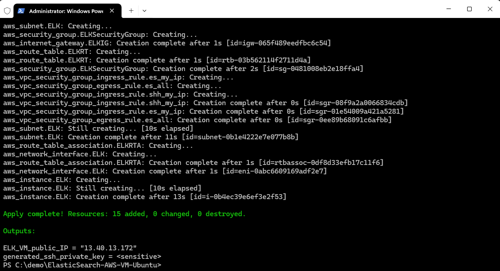

# ELK Quick Start - AWS

## Prerequisites

- Permission to `manage` the following types of resources in your AWS Cloud Infrastructure tenancy: `vpcs`, `internet-gateways`, `route-tables`, `security-groups`, `subnets`, and `instances`.

- Quota to create the following resources: 1 VPC, 1 subnet, 1 Internet Gateway, 1 route rule, and 1 compute instance.

## Deploy Using the Terraform CLI

### Clone the repository
Start with a local copy of this repo.  You can make that with the commands:

    git clone https://github.com/CalGrimes/ElasticSearch-AWS-VM-Ubuntu.git
    cd ElasticSearch-AWS-VM-Ubuntu

### Initialize the deployment

We now need to initialize the directory.  This makes the module aware of the AWS provider.  You can do this by running:

    terraform init

This gives the following output:


### Modify the configuration
Create a `terraform.tfvars` file and add the following configuration to it:

```hcl
aws_access_key="your_aws_access_key"
aws_secret_key="your_aws_secret_key"
region="us-west-2"
my_ip="your_public_ip"
```

### Deploy the module
Now for the main attraction.  Let's make sure the plan looks good:

    terraform plan  -var-file="terraform.tfvars"

That gives:


If that's good, we can go ahead and apply the deployment with:

    terraform apply -var-file="terraform.tfvars"

You'll need to enter `yes` when prompted.  Once complete, you'll see something like this:



When the apply is complete, the infrastructure will be deployed, but cloud-init scripts will still be running.  Those will wrap up asynchronously. So, it'll be a few more minutes before your cluster is accessible.  Now is a good time to get a coffee.

### Configuring Elasticsearch and Kibana
Once the module is deployed and you have waited for a few minutes, you can connect to the ELK VM and configure Elasticsearch and Kibana.

The output will show the ELK VM public IP and the generated ssh private key. The private key will be saved locally as ELK_private_key.pem. You can use this key to SSH into the ELK VM.

Now let's build SSH tunnels for each product of ELK:

`ELK_VM_public_IP = 13.40.13.172`

Create an SSH tunnel for ports `9200` and `5601` with the following command:

```
ssh -i ELK_private_key.pem -L 9200:localhost:9200 -L 5601:localhost:5601 ubuntu@<ELK_VM_public_IP>
```

Once you are connected to the ELK VM. Ensure the cloud-init scripts have completed by checking status of elastic and kibana services with the following command:
```
systemctl status elasticsearch kibana
```


Now you need to configure the network host in the Elasticsearch and Kibana configuration files. Run the following command to open the elasticsearch configuration file:

```
sudo vi /etc/elasticsearch/elasticsearch.yml
```


Add the following line to the configuration file:

`network.host: 0.0.0.0`

Save and exit the file.

Now open the kibana configuration file:
```
sudo vi /etc/kibana/kibana.yml
```


Add the following line to the configuration file:
`server.host: "0.0.0.0"`

Save and exit the file.

Now restart the Elasticsearch and Kibana services with the following command:

```
sudo systemctl restart elasticsearch kiabana
```


### Connect to Elasticsearch and Kibana
Now you can browse to (http://localhost:9200) for Elasticsearch, and (http://localhost:5601) for Kibana.


To fetch your enrollment token, you can run the following command:

```
sudo /usr/share/elasticsearch/bin/elasticsearch-create-enrollment-token --scope kibana
```

Paste the enrollment token and click 'Configure Elastic'


Next, collect the Kibana verfication code by running the following command:

```
sudo /usr/share/kibana/bin/kibana-verification-code
```

Now wait for Elastic to set everything up. 


You'll then be presented with a login screen. The superuser is elastic. 

To retrieve the password, you can run the following command:

```
sudo /usr/share/elasticsearch/bin/elasticsearch-reset-password -u elastic
```

At last you can login to Kibana with the superuser credentials and start exploring the dashboard.


## View the Cluster in the Console
You can also login to the web console [here](https://eu-west-2.console.aws.amazon.com/ec2/home?region=eu-west-2#Instances:) to view the IaaS that is running the cluster.


### Destroy the Deployment
When you no longer need the deployment, you can run this command to destroy it:

    terraform destroy

You'll need to enter `yes` when prompted.


