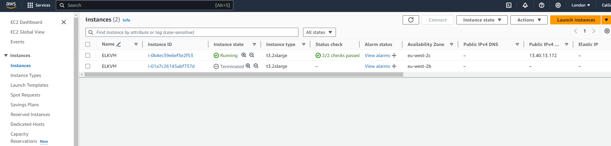

# ELK Quick Start - AWS

## Prerequisites

- Permission to `manage` the following types of resources in your AWS Cloud Infrastructure tenancy: `vpcs`, `internet-gateways`, `route-tables`, `security-groups`, `subnets`, and `instances`.

- Quota to create the following resources: 1 VPC, 1 subnet, 1 Internet Gateway, 1 route rule, and 1 compute instance.

## Deploy Using the Terraform CLI

### Clone the repository
Now, you'll want a local copy of this repo.  You can make that with the commands:

    git clone https://github.com/CalGrimes/ElasticSearch-AWS-VM-Ubuntu.git
    cd ElasticSearch-AWS-VM-Ubuntu
    ls

### Initialize the deployment

We now need to initialize the directory.  This makes the module aware of the AWS provider.  You can do this by running:

    terraform init

This gives the following output:


### Modify the configuration
Create a `terraform.tfvars` file and add the following configuration to it:

```hcl
aws_access_key="your_aws_access_key"
aws_secret_key="your_aws_secret_key"
region="us-west-2"
my_ip="your_public_ip"
```

### Deploy the module
Now for the main attraction.  Let's make sure the plan looks good:

    terraform plan  -var-file="terraform.tfvars"

That gives:


If that's good, we can go ahead and apply the deploy:

    terraform apply -var-file="terraform.tfvars"

You'll need to enter `yes` when prompted.  Once complete, you'll see something like this:


When the apply is complete, the infrastructure will be deployed, but cloud-init scripts will still be running.  Those will wrap up asynchronously.  So, it'll be a few more minutes before your cluster is accessible.  Now is a good time to get a coffee.


### Connect to Elasticsearch and Kibana
When the module is deployed, you will see an output that shows the ELK VM public IP and generated ssh private key. The private key will be saved locally as ELK_private_key.pem. You can use this key to SSH into the ELK VM.

Now let's build SSH tunnels for each product of ELK:

`ELK_VM_public_IP = 13.40.16.206`

Create an SSH tunnel for ports `9200` and `5601` with the following command:

`ssh -i ELK_private_key.pem -L 9200:localhost:9200 -L 5601:localhost:5601 ubuntu@<ELK_VM_public_IP>`


Now you can browse to (http://localhost:9200) for Elasticsearch, and (http://localhost:5601) for Kibana.


### Access the Dashboards
If you don't have an enrollment token, you can create one by clicking 'Create manually' and following the instructions.


### SSH to a Node
These machines are usingUbuntu.  The default login is ubuntu. You can SSH into the machine with a command like this:

    ssh -i ELK_private_key ubuntu@<ELK_VM_public_IP>

## View the Cluster in the Console
You can also login to the web console [here](https://eu-west-2.console.aws.amazon.com/ec2/home?region=eu-west-2#Instances:) to view the IaaS that is running the cluster.



### Destroy the Deployment
When you no longer need the deployment, you can run this command to destroy it:

    terraform destroy

You'll need to enter `yes` when prompted.


